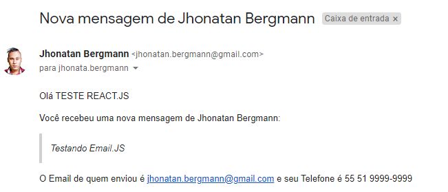
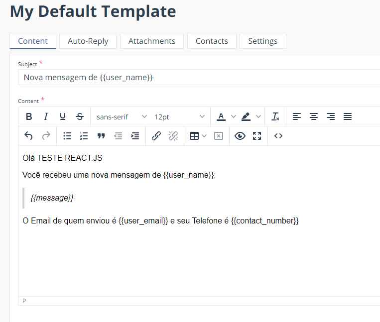
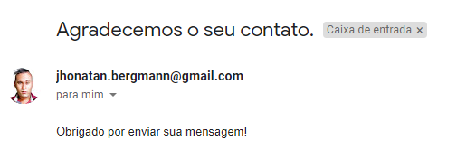
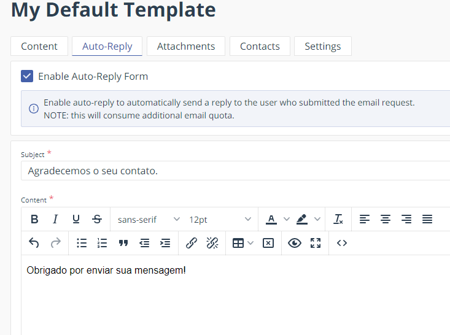

<h1>Contact Form</h1>

## 📧 Sobre

Formulário para contato utilizando EmailJS-com. Lottie para ter uma aparencia mais modera e o Modal para enviar a resposta de sucesso de email ao usuário.
  
Como funciona o EmailJS?
EmailJS ajuda a enviar e-mails usando apenas tecnologias do lado do cliente. Nenhum servidor é necessário - basta conectar o EmailJS a um dos serviços de e-mail suportados, criar um modelo de e-mail e usar nossa biblioteca Javascript para acionar um e-mail.

Os modelos de e-mail podem conter opcionalmente variáveis ​​dinâmicas em quase todos os campos (por exemplo, assunto, conteúdo, endereço PARA, nome DE, etc.) que são preenchidos a partir da chamada Javascript. Por exemplo, o assunto pode ser " {{nome}} , você tem uma nova mensagem", e usando JavaScript o nome pode ser definido como "James Dean", por exemplo.

Além disso, você pode adicionar anexos facilmente, exigir validação CAPTCHA, alternar entre os serviços de e-mail sem fazer alterações no código, revisar o histórico da solicitação de e-mail e muito mais.
 

- [Acesse aqui](https://www.emailjs.com/docs/introduction/how-does-emailjs-work/)

  
  

  <h3>Conteúdo da Mensagem</h3>
  
  
  
  <h3>Resposta Automatica</h3>
  
  

## 🌐 Tecnologias Usadas

Foram usadas essas tecnologias:

- [React](https://pt-br.reactjs.org/)
- [Yarn](https://yarnpkg.com/)
   - 
- [EmailJS-com](https://www.emailjs.com/)
- [Lottie](https://www.npmjs.com/package/react-lottie)
- [Modal](https://www.npmjs.com/package/react-modal)

_Foram usados outros Frameworks no projeto, mas esses são os principais._

## **_</>_** Como usar o código?

1. Instale o **Yarn** em seu computador
1. Instale o **NodeJs** na versão >= 12.0
1. Clone este repositório `git clone https://github.com/JhonatanBergmann/using-form.emailJS-com`

### 🌐 Web

1. Acesse o diretório e dê o comando `yarn install`
1. Acesse a pasta _web_ e dê o comando `yarn start`
1. Acesse em seu navegador a seguinte url `http://localhost:3000`

## 📝 Licença

Esse projeto está sob a licença MIT. Veja o arquivo [LICENSE](LICENSE) para mais detalhes.

---

 Feito com 💜 by Jhonatan Bergmann

