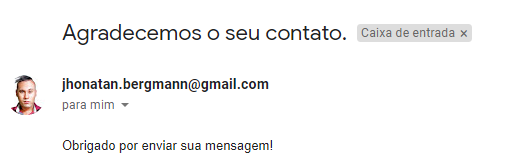
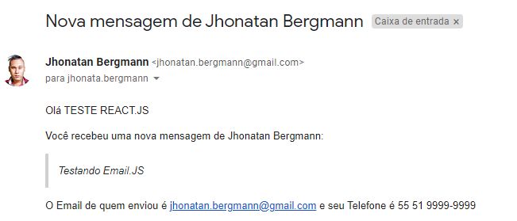
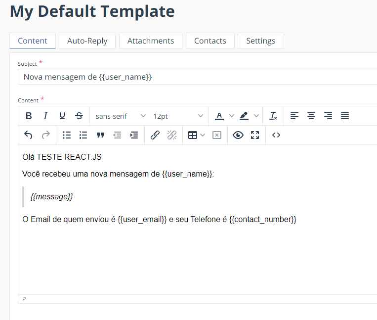

<h3 align="center">
  Form Email JS
</h3>

  
  

This project demonstrates how to integrate EmailJS for sending emails directly from a web application without needing a backend server. EmailJS allows you to send emails using client-side JavaScript by connecting to email services like Gmail, Outlook, and others.

🔹 Features:

- Send emails from a web form.
- No backend required.
- Easy integration with EmailJS API.

  

  
  
  
  

## 📦 Tech Stack

- React
- JavaScript
- EmailJS

[check in package.json](package.json)

## 🔩 Installation

To install and run the project locally, follow these steps:

1. Install [**Yarn**](https://yarnpkg.com/) on your computer
1. Clone the repository `git clone https://github.com/jhonbergmann/form-email-js.git`
1. Navigate to the project directory: `cd form-email-js`
1. Install the dependencies: `yarn install`

## ⚙️ Usage

1. Start the development server: `yarn start`
1. Remember, use node in version v16.15.0

## 📝 License

[MIT © Jhonatan Bergmann](https://github.com/jhonbergmann/form-email-js/blob/main/LICENSE)
